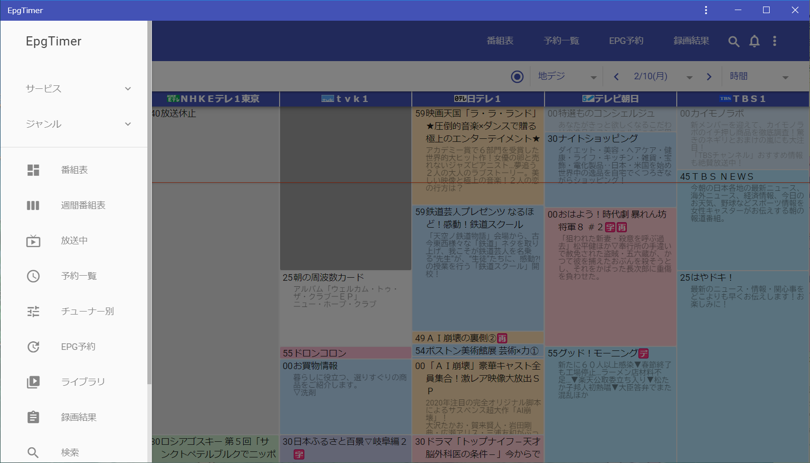

EDCB Material WebUI
===================

## 本家からの変更点

PWA 対応など、いくつかの改善を行っています

* 未承認の Pull Requests を個人的に取り込んだ
* PWA (Progressive Web Apps) に対応した
* 録画設定から録画保存フォルダを指定できるようにした
* EPG予約・録画結果画面でサイドパネルから予約・結果を削除できるようにした
* 余白が足りない部分などのスタイルを修正し、より見やすくした
* <s>FIND_BY_OPEN（名前付きパイプが見つからないときにパイプ名を推測して開くフラグ）を設定画面から設定できるようにした</s>（本家に取り込まれました）
* 本家の README がお世辞にもわかりやすいとは言い難い上誤字脱字が多かったので、（勝手に）加筆修正した

それ以外はオリジナルのままです  
EDCB_Material_WebUI を開発してくださった EMWUI さんに感謝します

---

**EDCB の WebUI を Material Design Lite を使いマテリアルデザインに沿うように表示するソフトです**  
予約の追加確認、番組表の表示などの基本的な機能のほか、リモート視聴、ファイル再生などができます  
また、[Legacy WebUI](https://github.com/xtne6f/EDCB/tree/work-plus-s/ini/HttpPublic/legacy) をベースとして作成しています  
おかげさまでド素人にも作成することができました、xtne6f 氏に感謝します

## 使い方

1. 必要なファイルをダウンロードする ( EDCB の [releases](https://github.com/xtne6f/EDCB/releases) と [ffmpeg.zeranoe.com](https://ffmpeg.zeranoe.com/builds/) から)
   * CivetWeb が組み込まれた EDCB 一式 ([ xtne6f 氏](https://github.com/xtne6f/EDCB) の [work-plus-s-180529](https://github.com/xtne6f/EDCB/releases/tag/work-plus-s-180529) 以降)
   * lua52.dll … (WebUI の表示に使用します)
   * ffmpeg.exe … (再生機能に使用します / 4.2 以降は [字幕関連に問題がある](https://github.com/EMWUI/EDCB_Material_WebUI/issues/17#issuecomment-692421720) ため 4.1.4 以下を推奨)
   * ffprobe.exe … (再生機能に使用します・FFmpeg に同梱)
   * readex.exe … (再生機能に使用します)
2. EDCB 同梱の Readme_Mod.txt の [*Civetwebの組み込みについて*](https://github.com/xtne6f/EDCB/blob/24efede96ae3c856c6419ee89b8fec6eeee8f8b6/Document/Readme_Mod.txt#L556-L660) をよく読む
   * Web サーバー周りの設定は全てこの項目に記載されています
3. EDCB の HTTP サーバ機能を有効化し、アクセス制御を設定する
   * EpgTimerSrv.ini に以下を追記するか、tkntrec 版の EpgTimer であれば EpgTimer の設定 → 基本設定 → ネットワーク → Httpサーバ から設定できます
   * `EnableHttpSrv=1`
   * `HttpAccessControlList=+127.0.0.1,+192.168.0.0/16`
   * Httpポートは `HttpPort=5510` のように指定可能です
     * カンマ区切りで複数指定できます (例: `HttpPort=5510,5530` )
     * HTTPS 対応のポートとする場合は末尾に s をつけてください (例: `HttpPort=80,443s` )
   * HTTPS に対応させる場合は、別途 OpenSSL に同梱されている libcrypto-1_1.dll・libssl-1_1.dll ( 64bit 版 EDCB の場合は 64bit 版 OpenSSL に同梱されている libcrypto-1_1-x64.dll・libssl-1_1-x64.dll ) と OpenSSL で生成した ssl_cert.pem を EpgTimerSrv.exe と同じフォルダに入れる必要があります
     * ssl_cert.pem の生成方法は先述の [Civetwebの組み込みについて](https://github.com/xtne6f/EDCB/blob/24efede96ae3c856c6419ee89b8fec6eeee8f8b6/Document/Readme_Mod.txt#L556-L660) に記載されています
     * ただし、そのままでは HTTPS でアクセスすることはできず、ssl_cert.pem の生成過程で作られる server.crt (自己署名証明書) を EMWUI を利用するデバイスにインストールしておく必要があります
4. http://localhost:5510/ にアクセスし、サーバー機能が有効になったことを確認する  
   * ここでうまく行かない場合は EDCB の設定の問題だと思われます
5. ファイルを適切に設置する (下記の配置例を参照)  
   * 解凍した EDCB-work-plus-s-bin.zip にこの EMWUI を放り込めばとりあえず動くはず
   * 配置例 (＊があるものは必ずその場所に配置)
   * 
          EDCB/
            ├─ HttpPublic/
            │   ├─ api/ ＊
            │   ├─ EMWUI/
            │   ├─ legacy/
            │   ├─ img/ *
            │   │   └logo/ *
            │   └─ video/ ＊
            ├─ Tools/
            │   ├─ ffmpeg.exe
            │   ├─ ffprobe.exe
            │   └─ readex.exe
            ├─ EpgDataCap_Bon.exe ＊
            ├─ EpgTimerSrv.exe ＊
            ├─ EpgTimer.exe ＊
            ├─ lua52.dll ＊
            └─ SendTSTCP.dll ＊
6. 放送中のテレビをリモート視聴する場合、EpgDataCap_Bon の設定 → ネットワーク設定 → TCP送信 から、  
   ラジオボタンで SrvPipe を選択し、ポートが 0 になっていることを確認して、追加ボタンをクリックして送信先一覧に追加する
   * 送信先一覧に 0.0.0.1:0 と表示されていれば OK です
   * 10秒ほどプレイヤーに砂嵐が流れたあと、Error : MEDIA_ERR_SRC_NOT_SUPPORTED (名前付きパイプが見つかりませんでした) というエラーが表示される場合は、正しく送信先が追加されていないと思われます
     * EpgDataCap_Bon.exe を開き、TCP送信: 0.0.0.1:0 と表示されているかどうか確認してください
   * 一部の環境 (EpgTimerSrv をサービス化している・OS が Windows7 の場合？) で、TCP 送信の設定を行ったのにリモート視聴が同様のエラーで失敗することがあります
     * その場合、HttpPublic.ini の \[SET\] 以下に、FIND_BY_OPEN=1 と追記し、もう一度試してみてください
     * このフォークを使用する場合は、設定 → 全般 → 名前付きパイプを推測して開く をオンにすることでも同様の設定が行えます
7. http://localhost:5510/EMWUI/ にアクセス出来たら準備完了です、設定を行いましょう

## 設定
基本的な設定は [設定ページ](http://localhost:5510/EMWUI/setting) にて行ってください  
必要に応じて、設定ファイル (Setting\HttpPublic.ini) の \[SET\] 以下に以下のキー[=デフォルト]を指定してください  
HttpPublic.ini は設定ページにて設定を保存すると作成されます

* `batPath[=EDCBのbatフォルダ]`  
  * 録画設定でこのフォルダの.batと.ps1が選択可能になります  
  * 変更する場合、必ずフルパスで設定してください
* `batFileTag=`  
  * 録画タグの候補を表示できるようになります  
  * カンマ区切りで指定してください

### テーマカラー
テーマカラーを変更することが出来ます  
[Material Design Lite の customize](http://www.getmdl.io/customize/index.html) で色を選択、cssをダウンロードし material.min.css を置き換えます  
もしくは設定ファイル (HttpPublic.ini) の CSS キーに下部に表示されている<LINK>タグを追加することでも可能です
\# 例`css=<link rel="stylesheet" href="https://code.getmdl.io/1.3.0/material.blue_grey-pink.min.css" />`  
* 一部 ( border 周り) が置き換えただけでは対応できない部分があります (.mark)
  * 気になる方は css を user.css に記述してください  
* 色は [Material design](http://www.google.com/design/spec/style/color.html#color-color-palette) から選択することをお勧めします  
  * .mark の border は A700 を指定しています

### 再生機能
**ffmpeg.exe、ffprobe.exe、readex.exeが必要です**  

* `ffmpeg[=Tools\ffmpeg]`  
  * ffmpeg.exe のパスを指定します
* `ffprobe[=Tools\ffprobe]`  
  * ffprobe.exeのパス
* `readex[=Tools\readex]`  
  * readex.exeのパス
* `xprepare[=48128]`  
  * 転送開始前に変換しておく量(bytes)

### 画質設定 ( ffmpeg オプション)
* `mp4[=0]`  
  * デフォルトで mp4 にトランスコードする場合 1 に設定してください

以下のような設定を書き込むとデフォルトと以下で指定した設定を読み込めるようになります

    [MOVIE]
    HD=-vcodec libvpx -b 1800k -quality realtime -cpu-used 2 $FILTER -s 960x540 -r 30000/1001 -acodec libvorbis -ab 128k -f webm -

もしくは [MOVIE] に `画質名=ffmpegオプション` を、[SET] の quality に画質名をコンマ区切りで記述することで、複数の設定を読み込むことができます  

例 (オプションはものすごく適当です)

    [SET]
    quality=720p,480p,360p
    [MOVIE]
    720p=-vcodec libvpx -b:v 1800k -quality realtime -cpu-used 2 $FILTER -s 1280x720 -r 30000/1001 -acodec libvorbis -ab 128k -f webm -
    480p=-vcodec libvpx -b:v 1500k -quality realtime -cpu-used 2 $FILTER -s 720x480 -r 30000/1001 -acodec libvorbis -ab 128k -f webm -
    360p=-vcodec libvpx -b:v 1200k -quality realtime -cpu-used 2 $FILTER -s 640x360 -r 30000/1001 -acodec libvorbis -ab 128k -f webm -
    NVENC=-vcodec h264_nvenc -profile:v main -level 31 -b:v 1408k -maxrate 8M -bufsize 8M -preset medium -g 120 $FILTER -s 1280x720 -acodec aac -ab 128k -f mp4 -movflags frag_keyframe+empty_moov -

* -i を指定する必要はありません  
* -f のオプションを必ず指定するようにしてください ( mp4 かどうかを判定しています)  
* リアルタイム変換と画質が両立するようにビットレート -b と計算量 -cpu-used を調整してください  
* オプションにて QSV なども有効なようです

### ライブラリ
録画保存フォルダのビデオファイル ( ts, mp4, webm 等)を表示・再生します  
Chrome 系ブラウザで mp4 を再生しようとするとエラーで再生できないことがありますが、`-movflags faststart` オプションを付けエンコードすることで再生できる場合があります  
また、公開フォルダ外のファイルはスクリプトを経由するため、シークできるブラウザとできないブラウザがあるようです  

* `LibraryPath=1`  
  * ライブラリに表示するフォルダを Common.ini 内に記載されている録画保存フォルダから HttpPublic.ini 内に記載されているフォルダに変更します
  * Common.ini と同じ形式で指定してください
  * 例
  * 
        [SET]
        LibraryPath=1
        RecFolderNum=2
        RecFolderPath0=C:\DTV
        RecFolderPath1=C:\hoge

### サムネイル
* HttpPublicFolder の video\thumbs フォルダに `(md5ハッシュ).jpg` があるとサムネを表示できます  
* ライブラリページのメニューからサムネイルを作成できます

## リモート視聴
**EpgDataCap_Bon.exe の設定と SendTSTCP.dll が必要です**  
※NwTV.ps1は使えなくなりました

* EpgDataCap_Bon.exe は NetworkTVモード で起動しています  
* NetworkTV モードを使用している場合は注意してください  
* **音声が切り替わったタイミングで止まることがありますがその時は再読み込みしてください**

## ファイル再生について
* トランスコードするファイル (ts) もシークっぽい動作を可能にしました (offset(転送開始位置(99分率))を指定して再読み込み)  
* 録画結果 (GetRecFileInfo()) からファイルパスを取得しています  
  録画後にリネームやフォルダを移動していると再生することが出来ません

## 放送中一覧
URL に `?webPanel=` を追加すると Vivaldi の WEB パネル向けのデザインになります  
WEB パネルに追加して使ってみてください

## 局ロゴ

局ロゴを表示できます

* TVTest の局ロゴを使用します  
* TVTest の設定から「BMP形式のロゴを保存する」にチェックを入れ、予めロゴを取得しておいてください  
  * TVTest のフォルダは EDCB のフォルダと同じ階層にあることを想定しています  
  * LogoData.ini が見つからない場合は、公開フォルダ下の `img\logo\ONIDSID{.png|.bmp}` (4桁で16進数)を表示します  
* TVTest のフォルダが想定と違う場合や LogoData.ini・Logo フォルダの設定を変更している場合は設定ファイルにて指定してください  
  * `LOGO_INI[=TVTestのフォルダ\LogoData.ini]`  
    * LogoData.ini へのパスを指定する  
  * `LOGO_DIR[=TVTestのフォルダ\Logo]`  
    * Logo フォルダへのパスを指定する  

## 番組表の隠しコマンド

以下を GET メソッドで取得します、URL に含めてください (例: epg.html?subch= )  
chcount と show は週間番組表では使用できません

* `hour=整数`  
  * 開始時間を指定する
* `interval=整数`  
  * 表示間隔を指定する 
  * デフォルト値 `PC=25` `スマホ=8`
* `chcount=整数`  
  * 読み込むチャンネル数を一時的に変更する  
  * デフォルト値 `PC=0(無制限)` `スマホ=15`  
  * showが有効時は非表示のチャンネルを含みます
* `show=`  
  * 非表示指定したチャンネルを読み込む(サイドバーで表示・非表示)  
  * 値は指定する必要はありません
* `subch=`  
  * サービス一覧でサブチャンネルを表示する  
  * 番組表だけでなくサービス一覧があるページで有効です (放送中・magnezio 等)

## お知らせ機能
登録した番組の開始30秒前にデスクトップ通知を行います  
video フォルダに notification.mp3 を用意すると通知音が出ます  
各自で用意してください

* PC のみの機能です
* Chrome では HTTPS 接続でないと通知が行えません (Chrome は HTTP 接続では通知の許可ダイヤログを表示できない)

## 注意
* チャンネルが増えたりしたら設定を保存しなおしてください (番組表に表示されません)
* **スタンバイの機能を使うにはスクリプト (api/Common) のコメントアウトを解除する必要があります**  

## 動作確認

- Windows
  - Chrome
  - Vivaldi
  - firefox
- Android
  - Chrome

## その他
**iOS 、スカパープレミアムの環境はありません。**  
このプログラムを使用し不利益が生じても一切の責任を負いません  
また改変・再配布などはご自由にどうぞ  
バグ報告は詳細に、こちらに環境がない箇所の場合は特に、対処できません

## Framework & JavaScriptライブラリ

* [Material Design Lite](http://www.getmdl.io)
* [Material icons](https://design.google.com/icons/)
* [dialog-polyfill](https://github.com/GoogleChrome/dialog-polyfill)
* [jQuery](https://jquery.com)
* [jQuery UI](https://jqueryui.com)
* [jQuery UI Touch Punch](http://touchpunch.furf.com)
* [Hammer.JS](http://hammerjs.github.io)
* [jquery.hammer.js](https://github.com/hammerjs/jquery.hammer.js)
